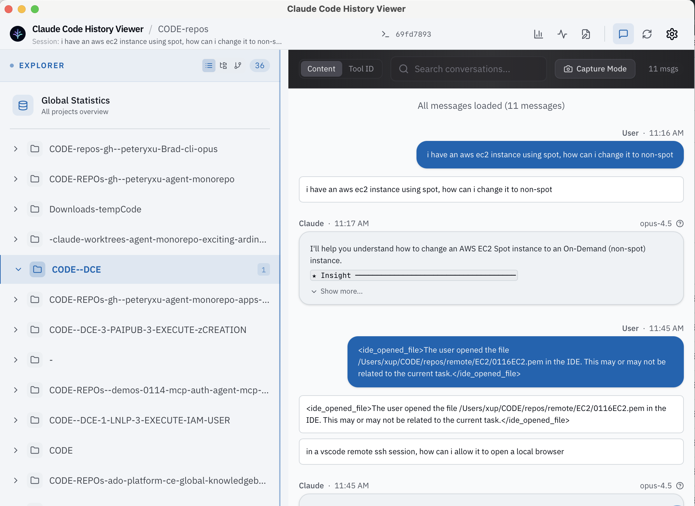
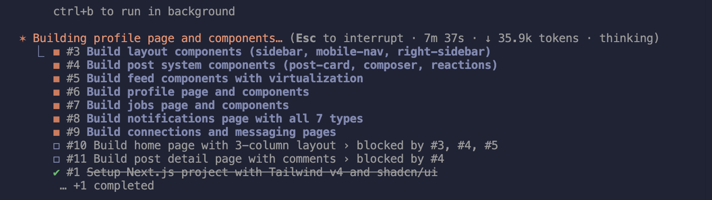
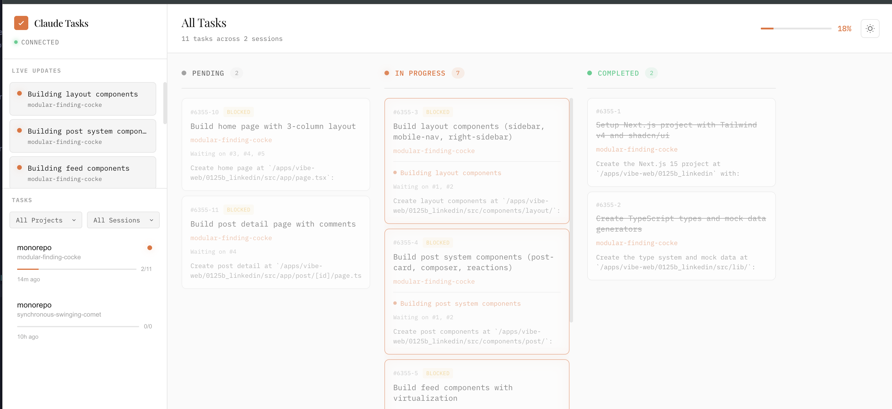
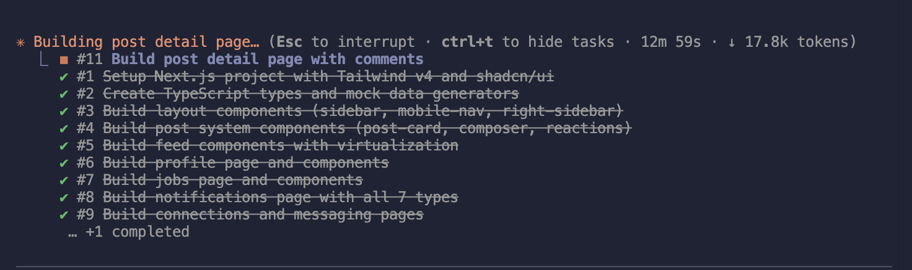
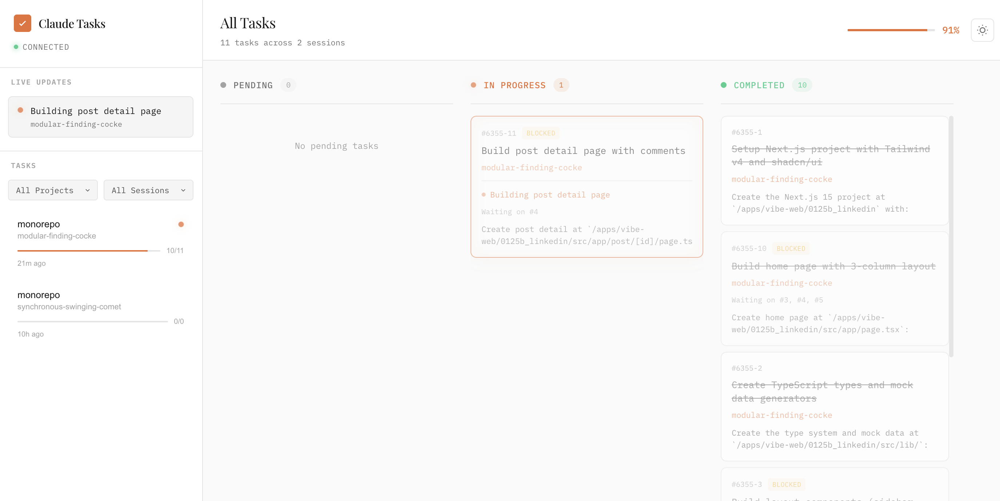

# Claude Code Utils

## Claude System Prompts & Change logs

- https://github.com/Piebald-AI/claude-code-system-prompts/blob/main/CHANGELOG.md
- 

## Claude Task Viewer

- https://github.com/L1AD/claude-task-viewer

npx claude-task-viewer

## Claude Code History Viewer

- https://github.com/jhlee0409/claude-code-history-viewer

# Examples

## Team Examples

## Task Examples

- https://x.com/kyleledbetter/status/2014841899031412943

Please thoroughly review @.docs/features/in-progress/topics/implementation.md , and put together ***Tasks for you and subagents* **to divide and conquer in parallel so you don't interfer with each other

